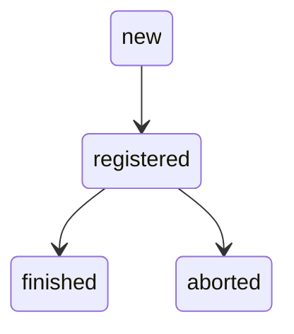
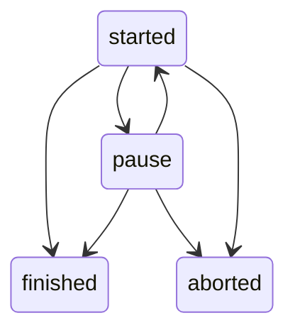
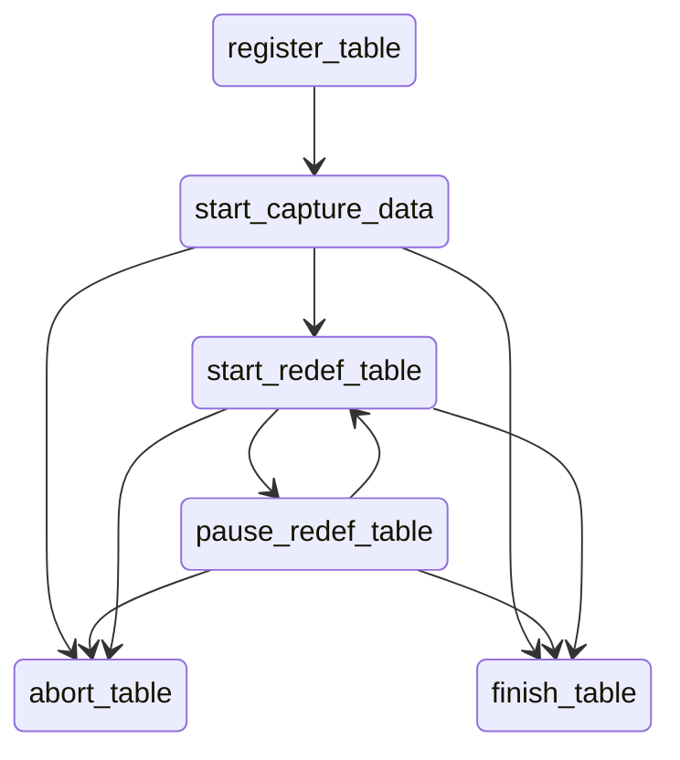

# Реорганизация таблиц

Расширение предназначено для онлайн манипуляций с данными в больших таблицах без простоя
(или с минимальным простоем, необходимым для создания служебных объектов).

## Возможные манипуяции с данными:
 * Из одной большуй таблицы сделать секционированную таблицу;
 * Добавить колонку в таблицу со значением по умолчанию;
 * Перенос данных на другой сервер СУБД с использованием FDW;
 * Обогатить данные из внешней системы;
 * Таблицу из большого количества колонок переделать в 2 таблицы с нужным количеством колонок;

## Краткое описание
Работа с таблицей состоит из нескольких частей частей.
1) Ручное создание нужной табицы (или нескольких таблиц) с той же структурой 
   или нескольких таблиц с нужной структурой. В случае, если структура таблицы, 
   куда переносить данные, изменилась, необходимо создать процедура по переносу строки данных. 
2) Регистрация конфигурации, в которой описано откуда, куда и как копировать данные.
   В процедуре регистрации указывается источник, приемник и различныпе другие параметры.
3) Копирования данных из существующей таблицы (источник) 
   в новую таблицу (приемник). При копировании строки   
   блокируются маленькими порциями (например по 1000 строк) 
   на время, необходимое на вставку порции строк в таблицу приемник.

## Режимы работы
Существует два режима работы
* Онлайн перенос данных - для захвата изменений создаются триггеры и в той же транзакции, 
  где происходит работа с основной таблицей, данные копируются в таблицу приемника. 
  Параллельно запускается процедура копирования данных из основной таблицы 
  маленькими порциями.
* Отложенный перенос данных - для захвата изменений данные в триггерах копируются 
  в таблицу изменений (mlog).
  Запускается процедура копирования данных из основной в таблицу изменений (mlog).
* Из таблицы изменений данные применяются в таблицу приемник.

### Рекомендации по выбору режима работы
* Онлайн перенос данных рекомендается использовать для создания копии таблицы 
на том же сервере СУБД, когда гарантированно нет задержек при применении данных.

* Отложенный перенос данных рекомендуется применять, если есть тяжелые операции
работы с данными, например нужно пересчитать поле или сходить во внешнюю 
систему для обогощения данных. Так же отложенный перенос рекомендуется применять
при созадании копии таблицы на внешнем сервере СУБД.

 
## Описание пользователльский функций 
### *pgpro_redefinition.register_redef_table*
Подготовка к переопределению таблицы.
Данная процедура регистрирует таблицу, которую нужно изменить (скопировать).
Таблица источник должна существовать.
Таблица приемник должана существовать.
    
#### Параметры
**configuration_name** - имя концигурации, текстовое поле, должно быть уникальным 
в рамках сервера СУБД.

* **type** - тип конфигурации - онлайн преобразование данных или отложенное преобразование.
  * **pgpro_redefinition._type_online()** - данные сразу копируются в таблицу назначения.
  * **pgpro_redefinition._type_deferred()** - данные копируются в таблицу изменений (mlog таблица), позднее в таблицу назначения. 

* **kind** - вид конфигуркции - 
  * **pgpro_redefinition._kind_redef()** - таблица приемник должна существовать. Данные копируются в таблицу приемник.
  * **pgpro_redefinition._kind_any()** - любое действие с данными таблицы, можно копировать, 
     можно разбить на 2 и более таблиц. Таблица приемник не устанавливается. Вся логика описывается в callback функции.

* **source_table_name** - имя таблицы источника. Задается всегда.
* **source_schema_name** - имя схемы источника. Задается всегда.
* **dest_table_name** - имя таблицы приемника. Может отсутствовать. -- todo - описать, когда может отсутствовать.
* **dest_schema_name** - имя схемы приемника. Может всегда. -- todo - описать, когда может отсутствовать.

* **callback_name** - процедура, которая переопределяет данные. В этой функции можно задать любое преобразованияе над строкой.
    Если callback не задан, создается процера, которая переносить данные один в один.
* **callback_schema_name** - имя схемы callback процедуры.

* **dest_pkey** - первичный ключ таблицы приемника. В некоторых случаях необходимо указать. 
  todo - описать случаи, когда первичный ключ нужен.
  Задается в формате jsonb, например dest_pkey=>'[{"pos": 1, "name": "id1", "type": "bigint"}, {"pos": 2, "name": "id2", "type": "bigint"}]'::jsonb $$


* **rows_redef** - количество строк, которые будут обработаны за один раз в одной транзации при копировании данных.
* **rows_apply** - количество строк, которые будут применяться в одной транзакции, в случает работы с таблицей изменений.
* **loop_redef** - кол-во циклов, запускаемых в одной процедуре при копировании данных. 
* **loop_apply** - кол-во циклов, запускаемых в одной процедуре при применении данных из таблицы изменений (mlog).
* **sleep_redef** - время сна после применения rows_redef. Параметр для снижения нагрузки на СУБД.
* **sleep_apply** - время сна после применения rows_apply. Параметр для снижения нагрузки на СУБД.

* **weight** - -- Вес конфигарациии при работе с большим количеством таблиц. todo - параметр не работает. 


##### Пример callback функции

### pgpro_redefinition._kind_redef()
Обязательное копирование данных из одной таблицы в другую

```plpgsql
create or replace function public.callback__table01 (
    source_old        source_schema.source_table
,   source_new        source_schema.source_table
,   dest_old out      dest_schema.dest_table
,   dest_new out      dest_schema.dest_table
) as
$redef$
declare
begin
    dest_old.id := source_old.id;
    dest_old.type := source_old.type;
    dest_old.data := source_old.data;

    dest_new.id := source_new.id;
    dest_new.type := source_new.type;
    dest_new.data := source_new.data;
end;
$redef$
language plpgsql;
```

## pgpro_redefinition._kind_any()
Любые преобразования данных. Копирование данных задается в самой процедуре/функции
В преобразовании any все действия с данными пользователь прописывает САМ в callback процедуре.
Процедура вызывается в тригерах и в момент копирования данных, ничего не возвразает.

```plpgsql
create or replace function public.callback__table01 (
    source_old        source_schema.source_table
,   source_new        source_schema.source_table
)   returns void
as
$redef$
declare
begin
    if source_old is null then
            insert into dest_fdw.dest_test01_table01 (
                    id1
                ,   id2
                ,   type
                ,   data
                ,   typy_data
                )
                values (
                    source_new.id1
                ,   source_new.id2
                ,   source_new.type
                ,   source_new.data
                ,   coalesce(source_new.type, ' - ') || ' updated ' || coalesce(source_new.data, ' - ')
                );
    elsif source_new is null then
            delete from dest_fdw.dest_test01_table01 where id1 = source_old.id1 and id2 = source_old.id2;
    elsif source_new <> source_old then
            update dest_fdw.dest_test01_table01
            set id1 = source_new.id1
            ,   id2 = source_new.id2
            ,   data = source_new.data
            ,   type = source_new.type
            ,   typy_data = coalesce(source_new.type, ' - ') || coalesce(source_new.data, ' - ')
            where id1 = source_old.id1 and id2 = source_old.id2;
    end if;
end;
$redef$
language plpgsql;

```


## Статусы

### Статусы (redef_table.status) всей конфигурации 
* Любая работа с данными возможна в статусе registered.
* При переходе статуса в finished: 
  * проверяется, что ВСЕ данные скопированы или перенесены
  * все задания завершаются
  * созданные ранее объекты (функции, триггера и другие) удаляются
  * данные из таблиц переносятся в таблицы со поствиксом _archive
  * при необходимости, таблица источник заменяется на таблицу приемника (переименование)
* При переводе в aborted:
  * задания завершается неуспешно
  * созданные ранее объекты (функции, триггера и другие) удаляются
  * данные из таблиц переносятся в таблицы со поствиксом _archive

#### Переходы


#### Статусы копирования данных 
Копирования данных может начаться только после того, как
начался захват данных, то есть сохранение данных в mlog или запущено сохранение 
данных в тригерах в таблицу приемника.

#### Переходы
**captured = true**


#### Статусы применения mlog 
Применение данных возможно только после начала сохранения данных в mlog.

#### Переходы
**captured = true**


### Жизненный цикл online преобразования



### Жизненный цикл deferred преобразования
Добавляется применение данных из mlog таблицы


## Варианты использования
### Секционировать большую таблицу
Необходимо секционировать таблицу по hash.
Исходная таблица.
```sql
drop table if exists table1;
drop sequence if exists seq_table1_id;
create sequence seq_table1_id;
create table table1 (
    id          bigint primary key  default nextval('seq_table1_id')
,   data        text default md5(random()::text)::text
);
insert into table1 select  from generate_series(1,10000) g;
```
1. Необходимо создать вспомогатульную (interim) таблицу с нужными полями, 
    которые полностью повторяют структуру исходной таблицы.
    Последовательности, от которых завися, которая используется в качестве первичного ключа лучше взять из основной таблицы.
```sql
drop table if exists interim_table1;
create table interim_table1 (
    id          bigint primary key default nextval('table1_pkey')
,   data        text default md5(random()::text)::text
) partition by hash (id);
create table interim_table1_p1 partition of interim_table1 for values with (modulus 2, remainder 0);
create table interim_table1_p2 partition of interim_table1 for values with (modulus 2, remainder 1);

```
2. Регистрация таблицы. 
   Обязательно нужно указыввать схемы источника и приемника.

```sql
call pgpro_redefinition.register_table(
    configuration_name                  => 'conf_table1'
,   type                                => pgpro_redefinition._type_online()
,   kind                                => pgpro_redefinition._kind_redef()
,   source_table_name                   => 'table1'
,   source_schema_name                  => 'public'
,   dest_table_name                     => 'interim_table1'
,   dest_schema_name                    => 'public'
);
```
После регистрации создаются различные объекты, которые используются для работы с данными.

3) Начать захват изменений.
```sql
call pgpro_redefinition.start_capture_data(
    configuration_name                  => 'conf_table1'
);
```
При DML операциях в основную таблицу, операции дублируются во вспомогательную таблицу.

4) Начать копирование данных.
```sql
call pgpro_redefinition.start_redef_table(
    configuration_name => 'conf_table1'
);
```
Копирование идет маленькими порциями. Посмотреть выполненные операции можно в таблице

```sql
select * 
from pgpro_redefinition.inc_stat
where configuration_name = 'conf_table1'
order by  ts_start desc ;
```
Как только поле dest_inserted равно 0, значит копирование данных завершено.

5) После заверения копирования вызывается процедура pgpro_redefinition.finish_table и переименовать старую таблицу на новую.
 Старую таблицу можно удалить.
```sql
call pgpro_redefinition.finish_table(
    configuration_name => 'conf_table1'
);
alter table table1 rename to table1_tmp2;
alter table interim_table1 rename to table1;
drop table table1_tmp2;

```
Дальше таблицей можно пользоваться как обычной таблицей. 

В случае, если необходимо прервать процесс, вызываетя процедура pgpro_redefinition.abort_table.
```sql
call pgpro_redefinition.abort_table(
    configuration_name => 'conf_table1'
);
```


## todo
* Добавить поддержку ванилы - примеры команд по запуску на нужных функций на баше.
* Оформить как расширение.
* Проверка callback функций на соответсвие требуемым параметрам.
* Добавить min_jobs, max_jobs - а как регилировать кол-во заданий в зависимости от нагрузки.
* Регистровать кол-во заданий в зависимости от времени - from 8:00 to 19:00 - jobs = 1,  from 19:00 to 08:00 - jobs = 8.
* Добавить sql_predicate - sql предикат, который добавляется в фукцию и триггер, который фильтрует данные.
* Флаг, останавливающий выполнения заданий репликации (ВСЕХ заданий).
* Протестить на учебной бд аэрофлота.
* Поправить права на вызов ф-ий.
* В случае неудачной репликации - показать, сохранить и обработать ошибку (реализовать операцию для возврата БД-источника в работу)
* Отлов ошибок в loop ф-ии, если ошибка deadlock, повтор n(5) раз. Loop не более 60 раз.
* Нагрузочные тесты.
* Оптимизации - задачи на исследование.
  * При удалении хранить только первичный ключ
  * Оптимизация индекса - индекс не отдает место при vacuum
    * Первичный ключ на mlog - попробовать оставить индекс только на lsn и pos
  * При применении mlog - передавать на приемник массив или json - и на приемнике 
    запускать что-то что сделает нужную работу с данными сразу на приемнике 
    (создавтаь временную таблицу и делать запрос из временной таблицы)
  * Распараллеливание при применении вставке данных в приемник.
  * БД проводит много времени в idle_in_transaction_time (select datname, idle_in_transaction_time from pg_stat_database)
* Функционал и тест по работе с большим количеством таблиц не готов.
